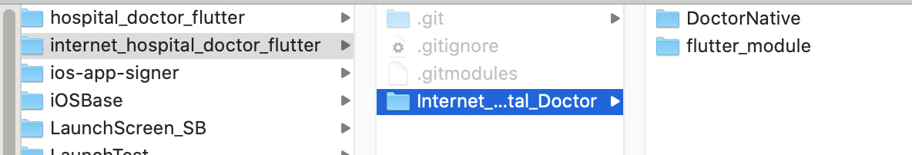
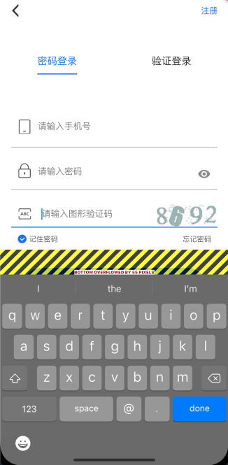
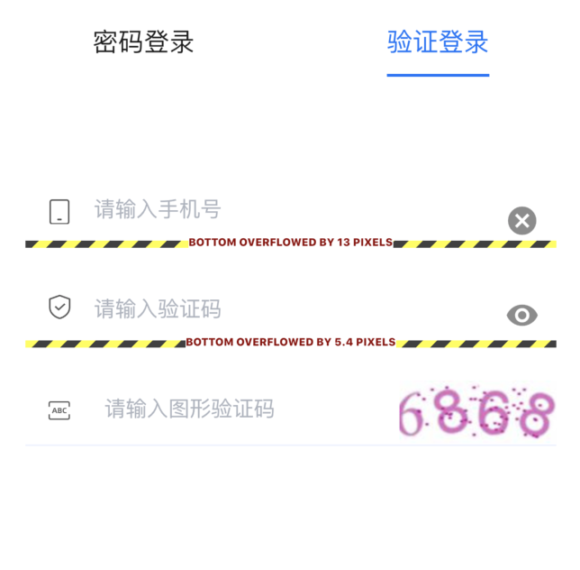

# 指南

### 项目主模块
flutter版本
```
_Test/FlutterTest_iOS   master ●  flutter --version
Flutter 1.16.4-pre.86 • channel flutter-1.17-candidate.5 •
https://gitee.com/Shelby_455/official_warehouse_of_flutter.git
Framework • revision a8b3d1b74f (4 个月前) • 2020-04-02 15:40:37 -0700
Engine • revision f56e678e7f
Tools • Dart 2.8.0 (build 2.8.0-dev.19.0 fae35fca47)
```

其中主项目仓库中包括原生iOS工程主体，
flutter_module（flutter模块）以子模块方式引入

### 问题
#### 1. 键盘遮挡控件，Flutter键盘遮挡控件会报越界错误


此处为键盘遮挡了登录按钮
解决方法
1）

```
Scaffold(
  resizeToAvoidBottomPadding: false, //输入框抵住键盘
```
该方法能够不报告布局越界错误，但键盘依旧会遮挡控件
所以该方法应用时最外层应该加一层空白点击层，使空白处被点击时键盘落下
```
Scaffold(
      backgroundColor: Colors.white,
      // 外层添加一个手势，用于点击空白部分，回收键盘
      body: new GestureDetector(
        onTap: (){
          // 点击空白区域，回收键盘
          print("点击了空白区域");
          _focusNodePassWord.unfocus();//  FocusNode _focusNodePassWord = new FocusNode();
          _focusNodeUserName.unfocus();
        },
```

或者 页面（子页面）所有焦点收起
```
GestureDetector(
                  behavior: HitTestBehavior.translucent,
                  onTap: () => FocusScope.of(context).requestFocus(FocusNode()),
                  child: SingleChildScrollView(
```

2）在控件外包一层SingleChildScrollView
该方法,该方法在使用时不能同时设置方法1）中的resizeToAvoidBottomPadding: false
否则方法将失效
该方法的优点是键盘弹出时，界面中最底部的空间允许滚到键盘的上方（及键盘永远不会遮挡任何空间），但键盘依旧不会自动落下，建议同方法1）中一样使用空白处点击回收键盘的方法。

3)莫名越界，同样的TextInputWidget在注册页没问题，在登录页出现底部越界，并且越界的尺寸不一致，问题在于左边的图片没设置宽高，并且左侧给的设计图尺寸不一，所以导致按照图片撑大子子控件，若子控件过大，父控件被Container包裹且设置了尺寸，则Container中的尺寸设置将无效化。


#### 2. Row中图文混排Text控件文字过长导致越界（如图）
 
 row中一个名字Text 一个性别Image 一个年龄Text
 根据需求把Image Text定宽
 名字过长则省略
 
 解决方法
 Text外包如下控件
* Flexible组件可以使Row、Column、Flex等子组件在主轴方向有填充可用空间的能力，但是不强制子组件填充可用空间。
 * Expanded组件可以使Row、Column、Flex等子组件在其主轴方向上展开并填充可用空间，是强制子组件填充可用空间。
这里用的是Flexible，因为这里需要在名字短的时候 右边的控件能够贴过来

此处后续改用富文本实现，上述说明为了更好的理解控件使用方法
  
  
#### 3.命名路由跳转错误

```
  @override
  Widget build(BuildContext context) {
    return ChangeNotifierProvider<ThemeViewModel>(
      create: (_) => ThemeViewModel(),
      child: Builder(
        builder: (context) => MaterialApp(
            onGenerateRoute: (setting) {
              return Routes.findRoutes(setting);
            },
            theme: Provider.of<ThemeViewModel>(context, listen: true).themeData,
            home: StartupPage(),
            ),
      ),
    );
  }
```
此处注册了命名路由Routes
到了首页后跳转
`Navigator.of(context).pushNamed(Routes.wzOrderDetail, arguments: _viewModel.orderList[position].id);`
报错
```
Exception has occurred.
FlutterError (Could not find a generator for route RouteSettings("/order/wz_detail", 1773) in the _WidgetsAppState.
Generators for routes are searched for in the following order:
 1. For the "/" route, the "home" property, if non-null, is used.
 2. Otherwise, the "routes" table is used, if it has an entry for the route.
 3. Otherwise, onGenerateRoute is called. It should return a non-null value for any valid route not handled by "home" and "routes".
 4. Finally if all else fails onUnknownRoute is called.
Unfortunately, onUnknownRoute was not set.)
```
原因
tabBarPage下的四孤岛为

```
    pages = <Widget>[Builder(
        builder: (context) => MaterialApp(
            onGenerateRoute: (setting) {
              return Routes.findRoutes(setting);
            },
            theme: Provider.of<ThemeViewModel>(context, listen: true).themeData,
            home: HomeTaskPage(),
            ),
      ),Builder(
        builder: (context) => MaterialApp(
            onGenerateRoute: (setting) {
              return Routes.findRoutes(setting);
            },
            theme: Provider.of<ThemeViewModel>(context, listen: true).themeData,
            home: HomeEPage(),
            )) , Builder(
        builder: (context) => MaterialApp(
            onGenerateRoute: (setting) {
              return Routes.findRoutes(setting);
            },
            theme: Provider.of<ThemeViewModel>(context, listen: true).themeData,
            home: HomeIMPage(),
            )), Builder(
        builder: (context) => MaterialApp(
            onGenerateRoute: (setting) {
              return Routes.findRoutes(setting);
            },
            theme: Provider.of<ThemeViewModel>(context, listen: true).themeData,
            home: HomeMinePage(),
            ))];
```
此处需要重新注册路由

#### 4.FlatButton的Color属性设置无效
FlatButton的color属性可以设置按钮的背景颜色，
但如果按钮的点击响应onPressed为null时，按钮默认为disable状态,如果按钮的disabledColor属性又为null，则其为默认颜色white

#### 5.flutter Incorrect use of ParentDataWidget
Expanded在Column、Row中的嵌套处理问题

#### 6.webview接入问题
当前项目使用的是  webview_flutter: ^0.3.22+1
若遇到下列问题
```
Trying to embed a platform view but the PrerollContext does not support embedding
Trying to embed a platform view but the PaintContext does not support embedding
```
必须在项目info.plist中加入下列权限

```
<key>io.flutter.embedded_views_preview</key>
<true/>
```

webview参数中需要加入
手势允许才可进行手写操作
```
gestureRecognizers: (Set()..add(Factory<EagerGestureRecognizer>(() => EagerGestureRecognizer()))),
```