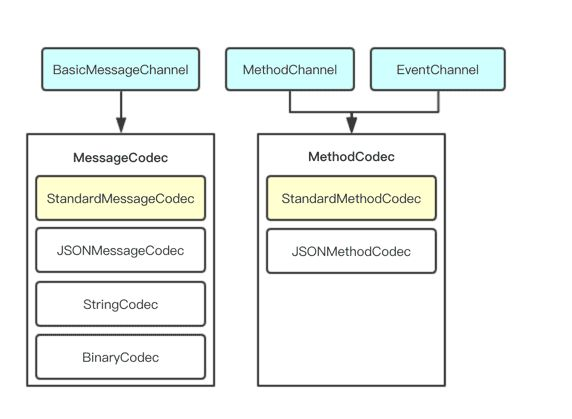

# iOS Flutter-Native交互
## 1.Platform Channel
#### 简介
##### 通信过程简述
Flutter应用通过Platform Channel将传递的数据编码成消息的形式，跨线程发送到该应用所在的宿主(Android或iOS)；
宿主接收到Platform Channel的消息后，调用相应平台的API，也就是原生编程语言来执行相应方法；
执行完成后将结果数据通过同样方式原路返回给应用程序的Flutter部分。

Platform Channel是Flutter与Flatform定制的**_通信机制_**,
他有以下三种
1. BasicMessageChannel:用于传递字符串和半结构化的信息（在大内存数据块传递的情况下使用）。
2. MethodChannel:用于传递方法的调用（method invocation）
3. EventChannel:用于数据流（event streams）的通信

三种Channel之间互相独立，各有用途，但它们在设计上却非常相近。每种Channel均有三个重要成员变量：
* name: String类型，代表Channel的名字，也是其唯一标识符。
* messager：BinaryMessenger类型，代表消息信使，是消息的发送与接收的工具。
* codec: MessageCodec类型或MethodCodec类型，代表消息的编解码器。
 

##### Channel name
​一个Flutter应用中可能存在多个Channel，每个Channel在创建时必须指定一个独一无二的name，Channel之间使用name来区分彼此。当有消息从Flutter端发送到Platform端时，会根据其传递过来的channel name找到该Channel对应的Handler（消息处理器）。
​
##### 消息信使:BinaryMessenger
​虽然三种Channel各有用途，但是他们与Flutter通信的工具却是相同的，均为BinaryMessager。
​
* ​BinaryMessenger是Platform端与Flutter端通信的工具，其通信使用的消息格式为二进制格式数据。当我们初始化一个Channel，并向该Channel注册处理消息的Handler时，实际上会生成一个与之对应的BinaryMessageHandler，并以channel name为key，注册到BinaryMessenger中。当Flutter端发送消息到BinaryMessenger时，BinaryMessenger会根据其入参channel找到对应的BinaryMessageHandler，并交由其处理。

* ​BinaryMessenger在Android端是一个接口，其具体实现为FlutterNativeView。而其在iOS端是一个协议，名称为FlutterBinaryMessenger，FlutterViewController遵循了它。

* ​BinaryMessenger并不知道Channel的存在，它只和BinaryMessageHandler打交道。而Channel和BinaryMessageHandler则是一一对应的。由于Channel从BinaryMessageHandler接收到的消息是二进制格式数据，无法直接使用，故Channel会将该二进制消息通过Codec（消息编解码器）解码为能识别的消息并传递给Handler进行处理。

​当Handler处理完消息之后，会通过回调函数返回result，并将result通过编解码器编码为二进制格式数据，通过BinaryMessenger发送回Flutter端。

##### 消息传递与编解码器

BinarryMessager要与三种Channel建立通信关系，中间需要一个“转换过程”，传递消息的格式是二进制，那么他需要一个编解码器。

一条BinaryMessage要传递下去，需要经过BinaryMessagerHandler（BinaryMessagerHandler有MessageHandler/MethodHandler/StreamHandler三种类型）
它将被注册到BinaryMessager上，与BinaryMessager一一对应。
二进制格式的消息通过消息解码器(Codec)解码为能识别的消息，并传递给Handler来进行处理。Handler处理完后，会把结果编码为二进制，在通过回调函数返回结果并发送回Flutter端。

消息编解码器Codec主要用于将二进制格式的数据转化为Handler能够识别的数据，Flutter定义了两种Codec：MessageCodec和MethodCodec。
##### Platform数据类型支持
Flutter默认的消息编解码器StandardMessageCodec目前支持的数据类型
  

##### 常见应用场景
1.Native初始化Flutter时向Flutter提供初始化参数
2.Native主动调用Flutter模块
3.Flutter主动调用Native
 
##### 使用方法
1.初始化Flutter提供参数
方法1：常用方法（仅仅初始化Flutter时可以传递字符串）
```
//Native
flutterViewController.setInitialRoute(param)//param为String
```
```
//Flutter 获取参数
main() {
  return runApp(TestWidget(
    initParams: window.defaultRouteName,
  ));
}
```
上述传统方法只能够传递初始化参数，并且只能够传递字符串
所以需要传递其他数据，请使用Json字符串再到Flutter端转码
iOS中setInitialRoute设置路由参数Flutter中根据window.defaultRouteName中参数可以指定跳转页面

//一般来讲下面的代码会进行抽取路由类
```
void main() => runApp(new MaterialApp(
  home: _widgetRouter(ui.window.defaultRouteName),
));


Widget _widgetRouter(String json){
  print("==== main === json = $json");
  String path = "test_sample";
  String param = "";
  if (json != null && json.isNotEmpty && json != "/") {
    var jsonResponse = jsonDecode(json);
    path = jsonResponse["path"];
    print("==== main === path = $path");
    param = jsonResponse["param"];
    print("==== main === param = $param");
    path = path != null && path.isNotEmpty ? path : "test_sample";
    param = param != null && param.isNotEmpty ? param : "";
    switch(path){
      case "test_sample":
        return MyHomePage(title: 'Flutter Demo Home Page');
      case "test_fade_app":
        return MyFadeTest();
    }

    return MyHomePage(title: 'Flutter Demo Home Page');
  }
}
```

方法2：使用Flutter-boost通过路由创建UI时传递参数
```
        FlutterBoostPlugin.open("xxx", urlParams:["title":"param"], exts: ["animated":true], onPageFinished: { (_ result:Any?) in
            print(String(format:"call me when page finished, and your result is:%@", result as! CVarArg));
        }) { (f:Bool) in
            print(String(format:"page is opened"));
        }
```
其中urlParams参数可以传递Map参数
“xxx”为Flutter端初始是注册的路由
```

  @override
  void initState() {
    super.initState();
    // eventChannel.receiveBroadcastStream().listen(_onEvent, onError: _onError);
FlutterBoost.singleton.registerPageBuilders({
      'xxx': (pageName, params, _) => XXX(
            title: params["title"],
          ),
    });
  }
```
上述Flutter-boost的注册路由方法需写在MyApp的initState方法中

上面两种方法最大的区别是，方法1每次通过Native创建Flutter界面时都会初始化一个Flutter引擎，Flutter Main函数每次都会执行，若项目中有很多Native-Flutter界面穿插的情况，Flutter引擎将会被初始化很多次，内存消耗剧增。
方法二使用Flutter-boost仅初始一次Flutter引擎，Flutter中Main函数仅走一次，引擎对内存造成的压力小，其次是Flutter中做数据单例保存的时候由于Flutter引擎仅初始化一次，所以该单例才是整个项目中Flutter端唯一的。

-------

2.Native调Flutter
1）messageChannel

初始化及回调设置务必放在Native对应VC的初始化方法里，时机太晚则无效
```
//初始化
messageChannel = FlutterBasicMessageChannel.init(name: "BasicMessageChannelPlugin", binaryMessenger: flutterViewController as! FlutterBinaryMessenger, codec: FlutterStringCodec.sharedInstance())
//回调设置
        messageChannel.setMessageHandler { [weak self] (message: Any?, reply: @escaping FlutterReply) in
            if let m = message as? String {
                reply("basicMessageChannel收到\(m)")
                self?.sendShow(m: m)
            }
        }
//主动传参
    messageChannel.sendMessage(message) {[weak self] (reply: Any?) in
        if reply != nil, reply is String {
        //这里是处理Flutter接收Handle之后的回复
            self?.sendShow(m: reply as! String)
        }
    }
```
2)eventChannel
第一步初始化channel以及设置对调代理务必放在Native对应VC的初始化方法里，时机太晚则无效
```
        eventChannel = FlutterEventChannel(name: "EventChannelPlugin", binaryMessenger: flutterViewController as! FlutterBinaryMessenger)
        eventChannel.setStreamHandler(self)//设置回调代理
```

```
//两个代理方法
 func onListen(withArguments arguments: Any?, eventSink events: @escaping FlutterEventSink) -> FlutterError? {
        self.eventSink = events
        return nil
    }
    
    func onCancel(withArguments arguments: Any?) -> FlutterError? {
        self.eventSink = nil
        return nil
    }
```

```
//该方法是Native给Flutter提供持续数据流的方法
eventSink?(message);//eventSink为FlutterEventSink类型，用于发送数据
```
3）methodChannel
初始化及回调设置务必放在Native对应VC的初始化方法里，时机太晚则无效

```
        methodChannel = FlutterMethodChannel(name: "MethodChannelPlugin", binaryMessenger: flutterViewController as! FlutterBinaryMessenger)
        
                methodChannel.setMethodCallHandler { [weak self] (call: FlutterMethodCall, result: @escaping FlutterResult) in

            print("call.arguments = \(call.arguments)")
            if call.method == "send", let dic = call.arguments as? [String: Any], let name = dic["value"] as? String {
                self?.sendShow(m: name)
            }
            if call.method == "send" , call.arguments is String{
                result("MethodChannelPlugin收到\(call.arguments)")
                self?.sendShow(m: call.arguments as! String)
            }
        }
    //向Flutter端发送  
let dic = NSMutableDictionary()
        dic["name"] = "张三"
        dic["age"] = 19
        methodChannel.invokeMethod("okr", arguments: dic);
```
-------

3.Flutter主动调用Native
1）messageChannel 初始化及回调设置需在initState方法完成
初始化
```
  static const BasicMessageChannel<String> _basicMessageChannel =
      const BasicMessageChannel('BasicMessageChannelPlugin', StringCodec());
```
设置回调
```
_basicMessageChannel.setMessageHandler((message) => Future<String>(() {
          setState(() {
            print("basicC");
            showMessage = "BasicMessageChannel:" + message;
          });
          return "收到Native消息: " + message;
        }));
```
发送
```
response = await _basicMessageChannel.send(value);
```

原生接收
```
messageChannel.setMessageHandler { [weak self] (message: Any?, reply: @escaping FlutterReply) in
    if let m = message as? String {
        reply("basicMessageChannel收到\(m)")
        self?.sendShow(m: m)
            }
        }
```
2）methodChannel 初始化及回调设置需在initState方法完成

初始化
```
  static const MethodChannel _methodChannelPlugin =
      const MethodChannel('MethodChannelPlugin');
```
设置回调
``` _methodChannelPlugin.setMethodCallHandler((call) => Future<dynamic>(() {
          if (call.method == "okr") {
            Map<String, dynamic> dic = new Map<String, dynamic>.from(call.arguments);
            print("dic = ${dic.runtimeType}");
            String str = 'MethodChannel:' + "name" + dic["name"] + "age" + dic["age"].toString();
            setState(() {
              showMessage = str;
            });
            return dic;
          }
        }));
```
发送
```
response = await _methodChannelPlugin.invokeMethod('send', {"value": "张三"});
```
这里有一个注意点
设置回调时获取的call.arguments是
_InternalLinkedHashMap<dynamic,dynamic>类型
需要进行一次转换
`Map<String, dynamic> dic = new Map<String, dynamic>.from(call.arguments);`
然后才可正常获取对应参数