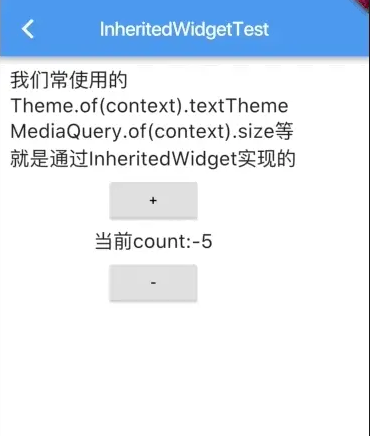

# Provider
Provider简介中第一句是A wrapper around InheritedWidget to make them easier to use and more reusable（InheritedWidget的包装，使它们更易于使用和更可重用）.
也就是说InheritedWidget能做的Provider也能做且做得更好，InheritedWidget不能做到的Provider也能做，
目前Provider已经成为了Flutter官方推荐库足以见得其强大以及重要性

那么InheritedWidget是什么
InheritedWidget它继承自ProxyWidget，并不属于StatefulWidget与StatelessWidget，所以他不是一个用来直接展示UI的Widget，InheritedWidget的作用是用来撮合其内部的Child进行数据共享及绑定

## InheritedWidget例子

这里+ 、 中间Text、 - 分别为A B C三个StatelessWidget

先定义一个内部传递的计数模型
```
class InheritedTestModel {
  final int count;
  const InheritedTestModel(this.count);
}
```
再创建一个撮合数据共享的InheritedWidget，这个InheritedContext并不知道内部Widget的情况，也不知道最终UI的样子，他只负责将传入的inheritedTestModel进行内部的共享，提供回调方法，我们可以把它想象为一个数据共享容器
```
class InheritedContext extends InheritedWidget {
  
  //数据
  final InheritedTestModel inheritedTestModel;

  //点击+号的方法
  final Function() increment;

  //点击-号的方法
  final Function() reduce;

  InheritedContext({
    Key key,
    @required this.inheritedTestModel,
    @required this.increment,
    @required this.reduce,
    @required Widget child,
  }) : super(key: key, child: child);

  static InheritedContext of(BuildContext context) {
    return context.inheritFromWidgetOfExactType(InheritedContext);
  }

  //是否重建widget就取决于数据是否相同
  @override
  bool updateShouldNotify(InheritedContext oldWidget) {
    return inheritedTestModel != oldWidget.inheritedTestModel;
  }
}
```
这里就是A B C三个StatelessWidget
```
class TestWidgetA extends StatelessWidget {
  @override
  Widget build(BuildContext context) {
    final inheritedContext = InheritedContext.of(context);

    final inheritedTestModel = inheritedContext.inheritedTestModel;

    print('TestWidgetA 中count的值:  ${inheritedTestModel.count}');
    return new Padding(
      padding: const EdgeInsets.only(left: 10.0, top: 10.0, right: 10.0),
      child: new RaisedButton(
          textColor: Colors.black,
          child: new Text('+'),
          onPressed: inheritedContext.increment),
    );
  }
}
class TestWidgetB extends StatelessWidget {
  @override
  Widget build(BuildContext context) {

    final inheritedContext = InheritedContext.of(context);

    final inheritedTestModel = inheritedContext.inheritedTestModel;

    print('TestWidgetB 中count的值:  ${inheritedTestModel.count}');

    return  new Padding(
      padding: const EdgeInsets.only(left: 10.0, top: 10.0, right: 10.0),
      child:  new Text('当前count:${inheritedTestModel.count}',style: new TextStyle(fontSize: 20.0),),
    );
  }
}
class TestWidgetC extends StatelessWidget {
  @override
  Widget build(BuildContext context) {

    final inheritedContext = InheritedContext.of(context);

    final inheritedTestModel = inheritedContext.inheritedTestModel;

    print('TestWidgetC 中count的值:  ${inheritedTestModel.count}');

    return new Padding(
      padding: const EdgeInsets.only(left: 10.0, top: 10.0, right: 10.0),
      child: new RaisedButton(
          textColor: Colors.black,
          child: new Text('-'),
          onPressed: inheritedContext.reduce),
    );
  }
}
```
最后弄一个页面将他展现
```
class InheritedWidgetTestContainer extends StatefulWidget {
  @override
  State<StatefulWidget> createState() {
    return new _InheritedWidgetTestContainerState();
  }
}

class _InheritedWidgetTestContainerState
    extends State<InheritedWidgetTestContainer> {
  InheritedTestModel inheritedTestModel;

  _initData() {
    inheritedTestModel = new InheritedTestModel(0);
  }

  @override
  void initState() {
    _initData();
    super.initState();
  }

  _incrementCount() {
    setState(() {
      inheritedTestModel = new InheritedTestModel(inheritedTestModel.count + 1);
    });
  }

  _reduceCount() {
    setState(() {
      inheritedTestModel = new InheritedTestModel(inheritedTestModel.count - 1);
    });
  }

  @override
  Widget build(BuildContext context) {
    return new InheritedContext(
        inheritedTestModel: inheritedTestModel,
        increment: _incrementCount,
        reduce: _reduceCount,
        child: new Scaffold(
          appBar: new AppBar(
            title: new Text('InheritedWidgetTest'),
          ),
          body: new Column(
            children: <Widget>[
              new Padding(
                padding: const EdgeInsets.only(left: 10.0, top: 10.0, right: 10.0),
                child: new Text('我们常使用的\nTheme.of(context).textTheme\nMediaQuery.of(context).size等\n就是通过InheritedWidget实现的',
                  style: new TextStyle(fontSize: 20.0),),
              ),
              new TestWidgetA(),
              new TestWidgetB(),
              new TestWidgetC(),
            ],
          ),
        ));
  }
}
```
我们可以发现最终UI的展现完全取决于这个页面的布局
但是这里的A B C三个组件却能共享来自容器组件的模型数据，并且点击+、-的时候，中间计数组件B可以实时刷新UI，就是说在同一个InheritedWidget容器内部的Child都完成了model->UI的单向绑定，并且每个内部组件都能够对内部model进行读写。

## Provider实现方法
首先我们不需要再自定义一个InheritedWidget控件
直接将页面改成这样，甚至不用写模型+模型-的方法
```
  @override
  Widget build(BuildContext context) {
    return ChangeNotifierProvider<InheritedTestModel>.value(
      child: Scaffold(
        appBar: new AppBar(
          title: new Text('InheritedWidgetTest'),
        ),
        body: new Column(
          children: <Widget>[
            new Padding(
              padding:
                  const EdgeInsets.only(left: 10.0, top: 10.0, right: 10.0),
              child: new Text(
                '我们常使用的\nTheme.of(context).textTheme\nMediaQuery.of(context).size等\n就是通过InheritedWidget实现的',
                style: new TextStyle(fontSize: 20.0),
              ),
            ),
            new TestWidgetA(),
            new TestWidgetB(),
            new TestWidgetC(),
          ],
        ),
      ),
      value: inheritedTestModel,
    );
}
```
我们需要将页面外层包裹ChangeNotifierProvider
其次模型做出修改

```
class InheritedTestModel extends ChangeNotifier {
  int count;

  InheritedTestModel(this.count);

  reduce() {
    count--;
    notifyListeners();
  }

  increment() {
    count++;
    notifyListeners();
  }
}
```
所有需要共享状态的模型都要继承或者with “ChangeNotifier”
由于属性可以修改所以构造方法不能再用const修饰
并在需要刷新UI的状态改变时调用notifyListeners();
A组件修改如下 C组件同样做如下改动（此处省略）
```
class TestWidgetA extends StatelessWidget {
  @override
  Widget build(BuildContext context) {
    final count = Provider.of<InheritedTestModel>(context).count;
    print('TestWidgetA 中count的值:  ${count}');
    return new Padding(
      padding: const EdgeInsets.only(left: 10.0, top: 10.0, right: 10.0),
      child: new RaisedButton(
          textColor: Colors.black,
          child: new Text('+'),
          onPressed: () {
            Provider.of<InheritedTestModel>(context, listen: false).increment();
          }),
    );
  }
}
```
这样我们可以直接在A/C组件中修改模型
B组件修改如下
```
class TestWidgetB extends StatelessWidget {
  @override
  Widget build(BuildContext context) {
    final count = context.select((InheritedTestModel value) => value.count);
// final count2 = Provider.of<InheritedTestModel>(context, listen: true).count;
// final count3 = context.watch<InheritedTestModel>().count;
    print('TestWidgetB 中count的值:  ${count}');

    return new Padding(
      padding: const EdgeInsets.only(left: 10.0, top: 10.0, right: 10.0),
      child: new Text(
        '当前count:${count}',
        style: new TextStyle(fontSize: 20.0),
      ),
    );
  }
}
```
由于仅做展示所以我们没必要用count2的获取方法，可以用count3的获取方法获取整个模型，当然根据需求直接用count的获取方法仅取count属性的内容当然更好。

####二者区别
1.传统实现方式使用了InheritedContext extends InheritedWidget中间容器类
并在子组件中还要获取这个中间类，然后再拿到需要的模型，这里子组件依赖上层组件，有耦合，且书写不灵活（总需要构建一个自定义容器组件），Provider无中间容器类只需要在需要共享数据的Widget外层套一个ChangeNotifierProvider即可。

2.Provider共享的模型仅此一份，并无传统方式的新建模型然后覆盖，如果模型内容简单还好，若是模型内容复杂，新建模型覆盖时，若只需该其中一个属性，则需要获取其他不变属性去覆盖，加大了代码可维护性，若是后期模型新增属性则维护成本更大。

3.如果说需要共享或者绑定的不止一个模型，而是多个模型呢?
InheritedContext需要持有多个模型），并且每构建一个InheritedContext都要根据多个模型写一套是否重新构建
```
  //是否重建widget就取决于数据是否相同
  @override
  bool updateShouldNotify(InheritedContext oldWidget) {
    return xxx;
  }
```
的逻辑，后期如果新添模型呢（构造方法得重写、用到该InheritedContext的地方得修改。。。），这样就会变得极难维护
Provider提供多模型方案MultiProvider,只需改成这样，其他地方都不变
```
  @override
  Widget build(BuildContext context) {
    return MultiProvider(
      providers: [
ChangeNotifierProvider<InheritedTestModel>.value(
          value: inheritedTestModel,
        )
      ],
      child: Scaffold(
        appBar: new AppBar(
          title: new Text('InheritedWidgetTest'),
        ),
        body: new Column(
          children: <Widget>[
            new Padding(
              padding:
                  const EdgeInsets.only(left: 10.0, top: 10.0, right: 10.0),
              child: new Text(
                '我们常使用的\nTheme.of(context).textTheme\nMediaQuery.of(context).size等\n就是通过InheritedWidget实现的',
                style: new TextStyle(fontSize: 20.0),
              ),
            ),
            new TestWidgetA(),
            new TestWidgetB(),
            new TestWidgetC(),
          ],
        ),
      ),
    );
    }
```


## 使用注意
Provider的使用必须是在相同widget树下，即MaterialApp（此处创建共享模型）
```
ChangeNotifierProvider.value(
        value: counter,
        child: MaterialApp(
          theme: ThemeData.dark(),
          home: Page1(),
        ),
      )
```
则后续push的路由界面都可共享此模型。
或者是一个路由界面（界面创建共享模型）的子widget控件可以获得模型

但是一个路由界面page1创建的共享模型无法被push到的下一个界面page2获取，原因是page2不是page1的子widge，在这里可以直接使用参数传递来传值

## 简易封装
许多项目中都会使用Provider做一层StatefulWidget的封装，方便使用

```

class ProviderWidget<T extends BaseViewModel> extends StatefulWidget {
  ProviderWidget({Key key, this.model, this.child, this.onReady, this.builder})
      : super(key: key);

  final Widget Function(BuildContext context, T value, Widget child) builder;
  final T model;
  final Widget child;
  final Function(T) onReady;

  @override
  _ProviderWidgetState<T> createState() => _ProviderWidgetState<T>();
}

class _ProviderWidgetState<T extends BaseViewModel> extends State<ProviderWidget<T>> {
  @override
  void initState() {
    // TODO: implement initState
    super.initState();
    if (widget.onReady != null) {
      widget.onReady(widget.model);
    }
  }

  @override
  Widget build(BuildContext context) {
    return ChangeNotifierProvider<T>(
      create: (_) => widget.model,
      child: Consumer<T>(
        builder: widget.builder,
        child: widget.child,
      ),
    );
  }
}


class ProviderWidget2<A extends BaseViewModel, B extends BaseViewModel>
    extends StatefulWidget {
  final Widget Function(BuildContext context, A model1, B model2, Widget child)
  builder;
  final A model1;
  final B model2;
  final Widget child;
  final Function(A, B) onModelReady;

  ProviderWidget2({
    Key key,
    @required this.builder,
    @required this.model1,
    @required this.model2,
    this.child,
    this.onModelReady,
  }) : super(key: key);

  _ProviderWidgetState2<A, B> createState() => _ProviderWidgetState2<A, B>();
}

class _ProviderWidgetState2<A extends BaseViewModel, B extends BaseViewModel>
    extends State<ProviderWidget2<A, B>> {
  A model1;
  B model2;

  @override
  void initState() {
    model1 = widget.model1;
    model2 = widget.model2;

    if (widget.onModelReady != null) {
      widget.onModelReady(model1, model2);
    }

    super.initState();
  }

  @override
  Widget build(BuildContext context) {
    return MultiProvider(
        providers: [
          ChangeNotifierProvider<A>(
            create: (context) => model1,
          ),
          ChangeNotifierProvider<B>(
            create: (context) => model2,
          )
        ],
        child: Consumer2<A, B>(
          builder: widget.builder,
          child: widget.child,
        ));
  }
}
```
其中BaseViewModel为viewmodel基类，继承于ChangeNotifier,onModelReady闭包为的是实现某些页面第一次加载时需要进行初次网络请求的需求,这层封装在MVVM架构下尤其重要。