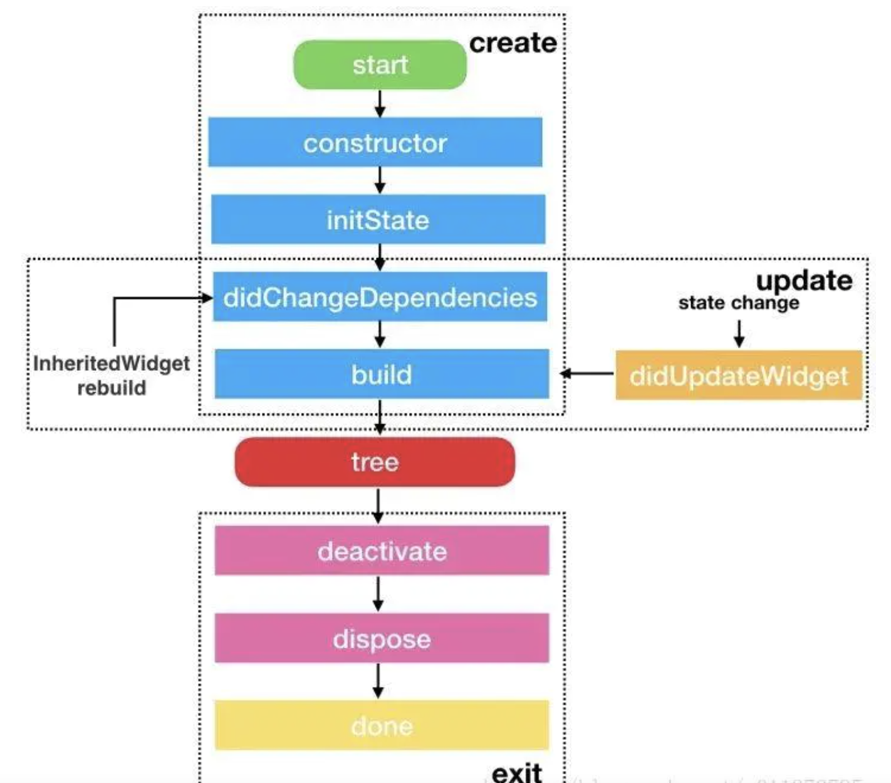

# Flutter学习笔记
## Flutter基础
### 1.StatelessWidget - 生命周期
StatelessWidget 的生命周期只有一个，就是 build
build 是用来创建 Widget 的，但因为 build 在每次界面刷新的时候都会调用，所以不要在 build 里写业务逻辑，可以把业务逻辑写到你的 StatelessWidget 的构造函数里。
* 无状态的Widget
* 无法提供setState修改组件的状态
* 内部属性应声明为final，防止意外发生改变

StatelessWidget一旦创建就不会发生变化,定义属性值可以变化,但不会重新渲染UI

### 2.StatefulWidget - 生命周期
* 构造函数
* initState
* didChangeDependencies
* build
* addPostFrameCallback
* (组件状态改变)didUpdateWidget
* deactivate
* dispose



state发生变化时会重新渲染UI，类似于Hot Reload
更新/刷新操作：setState(() {});
createState 此方法返回状态管理类，进行关联

### 3.WidgetsBinding.instance.addPostFrameCallback
addPostFrameCallback 是 StatefulWidget 渲染结束的回调，只会被调用一次，之后 StatefulWidget 需要刷新 UI 也不会被调用，
addPostFrameCallback 的使用方法是在 initState 里添加回调：
```
void initState() {
  super.initState();
  SchedulerBinding.instance.addPostFrameCallback((_) => {});
}
```
这个方法在一帧的最后调用，并且只调用一次,使用这个方法就可以在判断渲染完成，并获取到元素的大小。
``` 
@override
  void didChangeDependencies() {
    WidgetsBinding.instance.addPostFrameCallback(_onAfterRendering);
    super.didChangeDependencies();
  }

  @override
  void didUpdateWidget(T oldWidget) {
    WidgetsBinding.instance.addPostFrameCallback(_onAfterRendering);
    super.didUpdateWidget(oldWidget);
  }


  void _onAfterRendering(Duration timeStamp){
      //这里编写获取元素大小和位置的方法
  }
```
* 获取元素大小和位置:

```
//获取元素大小
RenderObject renderObject = context.findRenderObject();
Size size = renderObject.paintBounds.size;
//获取元素位置:
Vector3 vector3 = renderObject.getTransformTo(null)?.getTranslation();
//位置(vector3.x,vector3.y)
```

### 声明式UI介绍
[声明式UI](https://flutter.cn/docs/get-started/flutter-for/declarative)

### dart构造方法
1.不写extends默认继承自Object
系统将提供最基本的构造方法如Person()
如果定义自己的构造方法Person(this.name, this.age)
系统提供基本构造方法将会失效
```
class Person {
  String name;
  int age;
  Person(this.name, this.age);//Person();已失效
  ///重写父类方法
  @override
  String toString() {
    return 'name:$name, age:$age';
  }
}
```
继承类
```
class Student extends Person {
  //定义类的变量
  String _school; //通过下划线来标识私有字段（变量）
  String city;
  String country;
  String name;
  static Student instance;

  ///构造方法：
  ///通this.school初始化自有参数
  ///name,age交给父类进行初始化
  ///city为可选参数
  ///country设有默认参数
  Student(this._school, String name, int age,
      {this.city, this.country = 'China'})
      //初始化列表：除了调用父类构造器，在子类构造器方法体之前，你也可以初始化实例变量，不同的初始化变量之间用逗号分隔开
      : name = '$country.$city',
        //如果父类没有默认构造方法（无参构造方法），则需要在初始化列表中调用父类构造方法进行初始化
        super(name, age) {
    //构造方法体不是必须的
    print('构造方法体不是必须的');
  }

  //命名构造方法：[类名+.+方法名]
  //使用命名构造方法为类实现多个构造方法
  //命名构造方法也会让系统提供的基本构造方法失效
  Student.cover(Student stu) : super(stu.name, stu.age) {
    print('命名构造方法');
  }
  
  //命名工厂构造方法：factory [类名+.+方法名]
  //它可以有返回值，而且不需要将类的final变量作为参数，是提供一种灵活获取类对象的方式，能够使用返回值所有可以提供单例实现
。
  factory Student.stu(Student stu) {
    return Student(stu._school, stu.name, stu.age,
        city: stu.city, country: stu.country);
  }

  @override
  String toString() {
    return 'name:$name school:${this._school},city:$city,country:$country ${super.toString()}';
  }

  //可以为私有字段设置getter来让外界获取到私有字段
  String get school => _school;

  //可以为私有字段设置setter来控制外界对私有字段的修改
  set school(String value) {
    _school = value;
  }

  //静态方法
  static doPrint(String str) {
    print('doPrint:$str');
  }

  ///科普小知识：实例方法，对象的实例方法可以访问到实例变量与this，如上述代码中的toString
}

```


## flutter混合
### flutter混合项目集成
1.工程目录创建
xxx/flutter_hybrid/
flutter_hybrid作为大的文件目录,下一级放flutter_module文件夹与native工程文件夹
```
flutter create -t module flutter_module //创建flutter工程
```
然后在/flutter_hybrid/目录下放原生工程
此刻/flutter_hybrid/目录下有了
flutter_module
native
两个文件夹

2.配置CocoaPods
podfile添加Step1与Step2
```
# Step1：添加
flutter_application_path = '../flutter_module/'
load File.join(flutter_application_path, '.ios', 'Flutter', 'podhelper.rb')

target 'FlutterTest_iOS' do
  # Comment the next line if you don't want to use dynamic frameworks
  use_frameworks!
  # Step2
  install_all_flutter_pods(flutter_application_path)
  # Pods for FlutterTest_iOS

  target 'FlutterTest_iOSTests' do
    inherit! :search_paths
    # Pods for testing
  end

  target 'FlutterTest_iOSUITests' do
    # Pods for testing
  end
  
end
```
pod install拉取Flutter需要添加的配置

3.禁用Native主工程的Bitcode(Flutter不支持)

### flutter混合项目实现热重载(基于native项目可运行状态下)
1.模拟器关闭项目
2.vscode终端在flutter_module目录下
```
flutter attach
//或者
flutter attach -d 'xxx'//xxx为设备号
```
当终端出现`Waiting for a connection from Flutter on DEVICE`之后
主工程启动,进入flutter页面
终端出现
`Done.
Syncing files to device `
即可在vscode实现r热重载R热重启o系统切换
### 特别注意
1.xcode启动主项目后如果启动的是真机,若想切换为模拟器启动则必须删除ios目录下App.framework文件,反之亦然
2.vscode更改了flutter代码若需要在xcode中重启主项目则必须删除App.framework并pod install才可运行最新的flutter代码.

### flutter与iOS原生相互跳转
##### 准备工作:
1.flutter工程引入flutter_boost对应版本的插件(插件版本根据flutter版本参照github要求)
2.iOS工程在podfile中以引用本地库的方式引用第一步中packages get下来的flutter_boost插件(已有Step1与Step2该步骤可省略)
eg: 
`pod 'flutter_boost', :path => '../flutter_module/.ios/Flutter/.symlinks/flutter_boost/ios'`
##### 1.原生 push/present FlutterVC
1.在原生端创建一个路由实现类
`class PlatformRouterImp: NSObject, FLBPlatform`
用以实现路由跳转协议
```
func open(_ url: String, urlParams: [AnyHashable : Any], exts: [AnyHashable : Any], completion: @escaping (Bool) -> Void)
func present(_ url: String, urlParams: [AnyHashable : Any], exts: [AnyHashable : Any], completion: @escaping (Bool) -> Void)
func close(_ uid: String, result: [AnyHashable : Any], exts: [AnyHashable : Any], completion: @escaping (Bool) -> Void)
```
2.原生端在appdelegate中的`application(_ application: UIApplication, didFinishLaunchingWithOptions launchOptions: [UIApplication.LaunchOptionsKey: Any]?) -> Bool`
方法里完成第一步路由实现类的初始化,及插件设置
```
let router = PlatformRouterImp.init();
FlutterBoostPlugin.sharedInstance().startFlutter(with: router, onStart: { (engine) in
        });
```
3.flutter端创建一个目标widage
并且注册路由
```
  @override
  void initState() {
    super.initState();
    FlutterBoost.singleton.registerPageBuilders({
      'first': (pageName, params, _) => FirstRouteWidget(params: params),
    });
  }
```
4.在原生端需要push/present的地方调用
```
//push
    FlutterBoostPlugin.open("first", urlParams:["title":"MycallbackId#1"], exts: ["animated":true], onPageFinished: { (_ result:Any?) in
            print(String(format:"call me when page finished, and your result is:%@", result as! CVarArg));
        }) { (f:Bool) in
            print(String(format:"page is opened"));
        }
//present
    FlutterBoostPlugin.present("first", urlParams:["title":"MycallbackId#1"], exts: ["animated":true], onPageFinished: { (_ result:Any?) in
            print(String(format:"call me when page finished, and your result is:%@", result as! CVarArg));
        }) { (f:Bool) in
            print(String(format:"page is presented"));
        }
```
闭包为新flutter页面打开的回调
##### 2.FlutterVC push/present FlutterVC
1.flutter端创建一个目标widage
并且注册路由
``'second': (pageName, params, _) => SecondRouteWidget(params: params)`

2.在需要push/present的地方调用
```
//push
FlutterBoost.singleton.open("second",urlParams:<dynamic,dynamic>{"title":"true"}).then((Map value) {
    print( "call me when page is finished. did recieve second stateful route result $value");});
//present
FlutterBoost.singleton.open("second",urlParams:<dynamic,dynamic>{"title":"true", "present":true}).then((Map value) {
    print("call me when page is finished. did recieve second route result $value");});
```
then后面为新flutter页面打开的回调
##### 3.FlutterVC push/present 原生
1.PlatformRouterImp 协议方法 实现open/present 时实现flutter跳转原生的拦截
```
if let nativeVC = exts["isNative"] as? String, nativeVC == "YellowVC" {
    if let vc = YellowVC() as? UIViewController {
        self.navigationController().pushViewController(vc, animated: animated)
                return;
            }
        }
```
### flutter与iOS原生相互传值
#### 1.flutter端close
flutter端
```
FlutterBoost.singleton.close("id", result: <dynamic, dynamic>{
      "result": "flutter close"
    },exts: {
      "animated": 0
    });
```
原生端
```
func close(_ uid: String, result: [AnyHashable : Any], exts: [AnyHashable : Any], completion: @escaping (Bool) -> Void) {}
```
上id(String)对应下uid(String)
上result(map)对应下result
上若忽略exts则默认为[animated:1]

#### 2.flutter端传值
flutter端发送
```
FlutterBoost.singleton.channel.sendEvent("flutter2native",
                      {"message": "flutter say hello to native"});
```

原生端接收
```       
let pp = FlutterBoostPlugin.sharedInstance().addEventListener({ (name: String?, param: [AnyHashable : Any]?) in
             print("name = \(String(describing: name))")
             print("param = \(String(describing: param))");
         }, forName: "flutter2native");
```
其中name字段(flutter2native)只有对应在原生端才能够接收到此次传值内容
闭包中的name也是传值的name
其中pp为一个注销闭包,需要在控制器销毁的时候调用pp()注销监听
#### 3.原生端传值
原生端发送
```
FlutterBoostPlugin.sharedInstance().sendEvent("native2flutter", arguments: ["message": "xxxxxxx"]);
```
flutter端接收
```
  VoidCallback pp = FlutterBoost.singleton.channel.addEventListener("native2fluttes",
      (name, params) {
    print("$name--原生调用flutter-${params['message']}");
  });
```
这两个name必须对应flutter端才能够成功接收
其中pp为一个注销闭包,需要在控制器销毁的时候调用pp()注销监听

## 模型
[Json数据生成模型代码](https://www.devio.org/io/tools/json-to-dart/)

多级模型转换例子
1.底层模型CommonModel
```
class CommonModel {
  final String icon;
  final String title;
  final String url;
  final String statusBarColor;
  final bool hideAppBar;

  CommonModel(
      {this.icon, this.title, this.url, this.statusBarColor, this.hideAppBar});

  factory CommonModel.fromJson(Map<String, dynamic> json) {
    return CommonModel(
      icon: json['icon'],
      title: json['title'],
      url: json['url'],
      statusBarColor: json['statusBarColor'],
      hideAppBar: json['hideAppBar']
    );
  }
}
```
2.中间模型
```
class GridNavModel {
  final GridNavItem hotel;
  final GridNavItem flight;
  final GridNavItem travel;

  GridNavModel({this.hotel, this.flight, this.travel});

  factory GridNavModel.fromJson(Map<String, dynamic> json) {
    return json != null
        ? GridNavModel(
            hotel: GridNavItem.fromJson(json['hotel']),
            flight: GridNavItem.fromJson(json['flight']),
            travel: GridNavItem.fromJson(json['travel']),
          )
        : null;
  }
}

class GridNavItem {
  final String startColor;
  final String endColor;
  final CommonModel mainItem;
  final CommonModel item1;
  final CommonModel item2;
  final CommonModel item3;
  final CommonModel item4;

  GridNavItem(
      {this.startColor,
      this.endColor,
      this.mainItem,
      this.item1,
      this.item2,
      this.item3,
      this.item4});

  factory GridNavItem.fromJson(Map<String, dynamic> json) {
    return GridNavItem(
      startColor: json['startColor'],
      endColor: json['endColor'],
      mainItem: CommonModel.fromJson(json['mainItem']),
      item1: CommonModel.fromJson(json['item1']),
      item2: CommonModel.fromJson(json['item2']),
      item3: CommonModel.fromJson(json['item3']),
      item4: CommonModel.fromJson(json['item4']),
    );
  }
}
```
3.最外层模型
```
class HomeModel {
  final ConfigModel config;
  final List<CommonModel> bannerList;
  final List<CommonModel> localNavList;
  final List<CommonModel> subNavList;
  final GridNavModel gridNav;
  final SalesBoxModel salesBox;

  HomeModel(
      {this.config,
      this.bannerList,
      this.localNavList,
      this.subNavList,
      this.gridNav,
      this.salesBox});

  factory HomeModel.fromJson(Map<String, dynamic> json) {
    var localNavListJson = json['localNavList'] as List;
    List<CommonModel> localNavList =
        localNavListJson.map((i) => CommonModel.fromJson(i)).toList();

    var bannerListJson = json['bannerList'] as List;
    List<CommonModel> bannerList =
        bannerListJson.map((i) => CommonModel.fromJson(i)).toList();

    var subNavListJson = json['subNavList'] as List;
    List<CommonModel> subNavList =
        subNavListJson.map((i) => CommonModel.fromJson(i)).toList();

    return HomeModel(
      localNavList: localNavList,
      bannerList: bannerList,
      subNavList: subNavList,
      config: ConfigModel.fromJson(json['config']),
      gridNav: GridNavModel.fromJson(json['gridNav']),
      salesBox: SalesBoxModel.fromJson(json['salesBox']),
    );
  }
}
```
[github笔记持续更新](https://github.com/shelby-yao/AboutFlutter.git)
