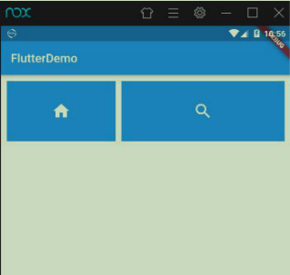

# Widget学习
## Center组件
```
class MyApp extends StatelessWidget {
  @override
  Widget build(BuildContext context) {
    // TODO: implement build
    return Center(
      child: Text(
        "我是 Dart 一个文本内容",
        textDirection: TextDirection.ltr,
        style: TextStyle(
            fontSize: 40.0,
            fontWeight: FontWeight.bold, // color: Colors.yellow
            color: Color.fromRGBO(255, 222, 222, 0.5)),
      ),
    );
  }
}
```
## MaterialApp组件
MaterialApp 是一个方便的 Widget，它封装了应用程序实现 Material Design 所需要的 一些 Widget。一般作为顶层 widget 使用。

```
常用的属性： 
home（主页） 
title（标题） 
color（颜色） 
theme（主题） 
routes（路由）
```

## Scaffold组件
Scaffold 是 Material Design 布局结构的基本实现。此类提供了用于显示 drawer、 snackbar 和底部 sheet 的 API。

```
Scaffold 有下面几个主要属性： 
appBar - 显示在界面顶部的一个 AppBar。 
body - 当前界面所显示的主要内容 Widget。 
drawer - 抽屉菜单控件。
```
```
class MyApp extends StatelessWidget {
  @override
  Widget build(BuildContext context) {
    // TODO: implement build
    return MaterialApp(
        title: "我是一个标题",
        home: Scaffold(
          appBar: AppBar(
            title: Text('Dart'),
            elevation: 30.0, //设置标题阴影 不需要的话值设置成 0.0 ),
            body: MyHome(),
          ),
          theme: ThemeData(
              //设置主题颜色
              primarySwatch: Colors.yellow),
        ));
  }
}
```
## Text 组件
| 名称 | 功能 |
| --- | --- |
| textAlign | 文本对齐方式（center 居中，left 左 对齐，right 右对齐，justfy 两端对齐） |
| textDirection | 文本方向（ltr 从左至右，rtl 从右至 左） |
| overflow | 文字超出屏幕之后的处理方式（clip 裁剪，fade 渐隐，ellipsis 省略号） |
| textScaleFactor | 字体显示倍率 |
| maxLines | 文字显示最大行数 |
| style | 字体的样式设置(TextStyle) |
下面是 TextStyle 的参数 ：

| 名称 | 功能 |
| --- | --- |
| decoration | 文字装饰线（none 没有线，lineThrough 删 除线，overline 上划线，underline 下划线） |
| decorationColor  | 文字装饰线颜色 |
| decorationStyle | 文字装饰线风格（[dashed,dotted]虚线， double 两根线，solid 一根实线，wavy 波浪 线） |
| wordSpacing | 单词间隙（如果是负值，会让单词变得更紧 凑 |
| letterSpacing | 字母间隙（如果是负值，会让字母变得更紧 凑） |
| fontStyle | 文字样式（italic 斜体，normal 正常体） |
| fontSize | fontSize 文字大小 |
| color | 文字颜色 |
| fontWeight | 字体粗细（bold 粗体，normal 正常体） |

更多参数：https://docs.flutter.io/flutter/painting/TextStyle-class.html

##  Container 组件

| 名称 | 功能 |
| --- | --- |
| alignment | topCenter：顶部居中对齐 topLeft：顶部左对齐 topRight：顶部右对齐 center：水平垂直居中对齐 centerLeft：垂直居中水平居左对齐 centerRight：垂直居中水平居右对齐 bottomCenter 底部居中对齐 bottomLeft：底部居左对齐 bottomRight：底部居右对齐 |
| decoration | decoration: BoxDecoration( color: Colors.blue, border: Border.all( color: Colors.red, width: 2.0, ),borderRadius: BorderRadius.all( Radius.circular(8.0) ) ) |
| margin | margin 属性是表示 Container 与外部其他 组件的距离。 EdgeInsets.all(20.0), |
| padding | padding 就 是 Container 的 内 边 距 ， 指 Container 边缘与 Child 之间的距离 padding: EdgeInsets.all(10.0) |
| transform | 让 Container 容易进行一些旋转之类的transform: Matrix4.rotationZ(0.2) |
| height | 容器高度 |
| width | 容器宽度 |
| child | 容器子元素 |

更多参数：https://api.flutter.dev/flutter/widgets/Container-class.html

## Image组件
图片组件是显示图像的组件，Image 组件有很多构造函数，这里是两个常见的 
Image.asset 本地图片
Image.network 远程图片

Image 组件的常用属性:

| 名称 | 类型 | 功能 |
| --- | --- | --- |
| alignment | Alignment | 图片的对齐方式 |
| color 和 colorBlendMode |  | 设置图片的背景颜色，通常和 colorBlendMode 配合一起 使用，这样可以是图片颜色和背景色混合。上面的图片就 是进行了颜色的混合，绿色背景和图片红色的混合 |
| fit | BoxFit | fit 属性用来控制图片的拉伸和挤压，这都是根据父容器来 的。BoxFit.fill:全图显示，图片会被拉伸，并充满父容器。 BoxFit.contain:全图显示，显示原比例，可能会有空隙。 BoxFit.cover：显示可能拉伸，可能裁切，充满（图片要 充满整个容器，还不变形）。BoxFit.fitWidth：宽度充满（横向充满），显示可能拉伸， 可能裁切。 BoxFit.fitHeight ：高度充满（竖向充满）,显示可能拉 伸，可能裁切。 BoxFit.scaleDown：效果和 contain 差不多，但是此属 性不允许显示超过源图片大小，可小不可大。| 
| repeat |   | ImageRepeat.repeat : 横向和纵向都进行重复，直到铺满整 个画布。 ImageRepeat.repeatX: 横向重复，纵向不重复。 ImageRepeat.repeatY：纵向重复，横向不重复。 |
| width | | 宽度 一般结合 ClipOval 才能看到效果 |
| height | | 高度 一般结合 ClipOval 才能看到效果 |

更多属性参考：https://api.flutter.dev/flutter/widgets/Image-class.html

```
class MyApp extends StatelessWidget {
  @override
  Widget build(BuildContext context) {
    // TODO: implement build
    return Center(
      child: Container(
        child: Image.network(
          "http://pic.baike.soso.com/p/20130828/20130828161137-1346445960.jpg",
          alignment: Alignment.topLeft,
          color: Colors.red,
          colorBlendMode: BlendMode.colorDodge,
// repeat: ImageRepeat.repeatX,
          fit: BoxFit.cover,
        ),
        width: 300.0,
        height: 400.0,
        decoration: BoxDecoration(color: Colors.yellow),
      ),
    );
  }
}
```

引入本地图片

然后，打开 pubspec.yaml 声明一下添加的图片文件，注意要配置对


```
    return Center(
      child: Container(
        child: Image.asset("images/a.jpeg", fit: BoxFit.cover),
        width: 300.0,
        height: 300.0,
        decoration: BoxDecoration(color: Colors.yellow),
      ),
    );
```
图片圆角

```
    return Center(
      child: Container(
        width: 300.0,
        height: 300.0,
        decoration: BoxDecoration(
            color: Colors.yellow,
            borderRadius: BorderRadius.circular(150),
            image: DecorationImage(
                image: new NetworkImage(
                    "http://pic.baike.soso.com/p/20130828/20130828161137-1346445960.jpg"),
                fit: BoxFit.cover)),
      ),
    );
```
实现圆形图片
```
    return Center(
      child: Container(
          child: ClipOval(
        child: Image.network(
          "http://pic.baike.soso.com/p/20130828/20130828161137-1346445960.jpg",
          width: 150.0,
          height: 150.0,
        ),
      )),
    );
```

## ListView 组件
Flutter中可以通过ListView来定义列表项，支持垂直和水平方向展示。通过一个属性就可以控制列表的显示方向。列表有以下分类：
1、垂直列表
2、垂直图文列表
3、水平列表
4、动态列表
5、矩阵式列表

ListView列表参数

| 名称 | 类型  | 说明 |
| --- | --- | --- |
| scrollDirection | Axis | Axis.horizontal 水平列表 Axis.vertical 垂直列表 |
| padding | EdgeInsetsGeometry | 内边距 |
| resolve | bool | 组件反向排序 |
| children | List<Widget> | 列表元素 |


```
class HomeContent extends StatelessWidget {
  @override
  Widget build(BuildContext context) {
    // TODO: implement build
    return Center(
      child: ListView(
        children: <Widget>[
          ListTile(
            leading: Icon(Icons.phone),
            title: Text(
              "this is list",
              style: TextStyle(fontSize: 28.0),
            ),
            subtitle: Text('this is list this is list'),
          ),
          ListTile(
            title: Text("this is list"),
            subtitle: Text('this is list this is list'),
            trailing: Icon(Icons.phone),
          ),
          ListTile(
            title: Text("this is list"),
            subtitle: Text('this is list this is list'),
          ),
          ListTile(
            title: Text("this is list"),
            subtitle: Text('this is list this is list'),
          ),
          ListTile(
            title: Text("this is list"),
            subtitle: Text('this is list this is list'),
          )
        ],
      ),
    );
  }
}
```
水平列表

```
class HomeContent extends StatelessWidget {
  @override
  Widget build(BuildContext context) {
    // TODO: implement build
    return Container(
        height: 200.0,
        margin: EdgeInsets.all(5),
        child: ListView(
          scrollDirection: Axis.horizontal,
          children: <Widget>[
            Container(
              width: 180.0,
              color: Colors.lightBlue,
            ),
            Container(
              width: 180.0,
              color: Colors.amber,
              child: ListView(
                children: <Widget>[
                  Image.network(
                      'https://resources.ninghao.org/images/childhood-in-a-picture.jpg'),
                  SizedBox(height: 16.0),
                  Text(
                    '这是一个文本信息',
                    textAlign: TextAlign.center,
                    style: TextStyle(fontSize: 16.0),
                  )
                ],
              ),
            ),
            Container(
              width: 180.0,
              color: Colors.deepOrange,
            ),
            Container(
              width: 180.0,
              color: Colors.deepPurpleAccent,
            ),
          ],
        ));
  }
}
```
动态ListView

```
class HomeContent extends StatelessWidget {
  List list = new List();
  HomeContent({Key key}) : super(key: key) {
    for (var i = 0; i < 20; i++) {
      list.add("这是第${i}条数据");
    }
    print(list);
  }
  @override
  Widget build(BuildContext context) {
    // TODO: implement build
    return ListView.builder(
      itemCount: this.list.length,
      itemBuilder: (context, index) {
        // print(context);
        return ListTile(
          leading: Icon(Icons.phone),
          title: Text("${list[index]}"),
        );
      },
    );
  }
}
```
## GridView 组件
GridView 创建网格列表有多种方式，下面是主要的两种。
1、可以通过 GridView.count 实现网格布局 
2、通过 GridView.builder 实现网格布局
常用属性：

| 名称 | 类型  | 说明 |
| --- | --- | --- |
|scrollDirection| Axis| 滚动方法|
| padding| EdgeInsetsGeometry| 内边距|
|resolve |bool |组件反向排序 |
|crossAxisSpacing |double |水平子 Widget 之间间距 |
| mainAxisSpacing| double| 垂直子 Widget 之间间距 |
|crossAxisCount| int |一行的 Widget 数量|
| childAspectRatio| double| 子 Widget 宽高比例 |
|children| | \<Widget\>[] | 
|gridDelegate| SliverGridDelegateWithFix edCrossAxisCount（常用） SliverGridDelegateWithMax CrossAxisExtent| 控制布局主要用在 GridView.builder 里面|
GridView.count 实现网格布局

```
class LayoutContent extends StatelessWidget {
  List<Widget> _getListData() {
    var tempList = listData.map((value) {
      return Container(
        child: Column(
          children: <Widget>[
            Image.network(value["imageUrl"]),
            SizedBox(height: 12),
            Text(value["title"],
                textAlign: TextAlign.center, style: TextStyle(fontSize: 20)),
          ],
        ),
        decoration: BoxDecoration(
            border: Border.all(
                color: Color.fromRGBO(230, 230, 230, 0.9), width: 1.0)),
      );
    }); // ('124124','124214')
    return tempList.toList();
  }

  @override
  Widget build(BuildContext context) {
    // TODO: implement build
    return GridView.count(
      padding: EdgeInsets.all(20), crossAxisCount: 2, crossAxisSpacing: 20,
      mainAxisSpacing: 20, // childAspectRatio:0.7,
      children: this._getListData(),
    );
  }
}
```
GridView.builder 实现网格布局

```
class LayoutContent extends StatelessWidget {
  Widget _getListData(context, index) {
    return Container(
      child: Column(
        children: <Widget>[
          Image.network(listData[index]["imageUrl"]),
          SizedBox(height: 12),
          Text(listData[index]["title"],
              textAlign: TextAlign.center, style: TextStyle(fontSize: 20)),
        ],
      ),
      decoration: BoxDecoration(
          border: Border.all(
              color: Color.fromRGBO(230, 230, 230, 0.9), width: 1.0)),
    );
  }

  @override
  Widget build(BuildContext context) {
    // TODO: implement build

    return GridView.builder(
      itemCount: listData.length,
      gridDelegate: SliverGridDelegateWithFixedCrossAxisCount(
          //横轴元素个数
          crossAxisCount: 2, //纵轴间距
          mainAxisSpacing: 20.0, //横轴间距
          crossAxisSpacing: 10.0, //子组件宽高长度比例
          childAspectRatio: 1.0),
      itemBuilder: this._getListData,
    );
  }
}

```
## Paddiing 组件
在 html 中常见的布局标签都有 padding 属性，但是 Flutter 中很多 Widget 是没有 padding 属 性。这个时候我们可以用 Padding 组件处理容器与子元素直接的间距。
```
class LayoutDemo extends StatelessWidget {
  @override
  Widget build(BuildContext context) {
    return Padding(
      padding: EdgeInsets.fromLTRB(0, 0, 10, 0),
      child: GridView.count(
        crossAxisCount: 2,
        childAspectRatio: 1.5,
        children: <Widget>[
          Padding(
            padding: EdgeInsets.fromLTRB(10, 10, 0, 0),
            child: Image.network('https://www.itying.com/images/flutter/1.png',
                fit: BoxFit.cover),
          ),
          Padding(
            padding: EdgeInsets.fromLTRB(10, 10, 0, 0),
            child: Image.network('https://www.itying.com/images/flutter/2.png',
                fit: BoxFit.cover),
          ),
          Padding(
            padding: EdgeInsets.fromLTRB(10, 10, 0, 0),
            child: Image.network('https://www.itying.com/images/flutter/3.png',
                fit: BoxFit.cover),
          ),
          Padding(
            padding: EdgeInsets.fromLTRB(10, 10, 0, 0),
            child: Image.network('https://www.itying.com/images/flutter/4.png',
                fit: BoxFit.cover),
          ),
          Padding(
            padding: EdgeInsets.fromLTRB(10, 10, 0, 0),
            child: Image.network('https://www.itying.com/images/flutter/5.png',
                fit: BoxFit.cover),
          ),
          Padding(
            padding: EdgeInsets.fromLTRB(10, 10, 0, 0),
            child: Image.network('https://www.itying.com/images/flutter/6.png',
                fit: BoxFit.cover),
          ),
        ],
      ),
    );
  }
}
```


## Row 水平布局组件
| 属性 | 说明  |
| --- | --- |
| mainAxisAlignment | 主轴的排序方式 |
| crossAxisAlignment | 次轴的排序方式 |
| children | 组件子元素 |
```
void main() => runApp(MyApp());
class MyApp extends StatelessWidget {
  @override
  Widget build(BuildContext context) {
    // TODO: implement build
    return MaterialApp(
        home: Scaffold(
      appBar: AppBar(title: Text('FlutterDemo')),
      body: LayoutDemo(),
    ));
  }
}

class LayoutDemo extends StatelessWidget {
  @override
  Widget build(BuildContext context) {
    return Container(
      height: 700,
      width: 500,
      color: Colors.black26,
      child: Row(
        crossAxisAlignment: CrossAxisAlignment.center,
        mainAxisAlignment: MainAxisAlignment
            .spaceEvenly, // crossAxisAlignment: CrossAxisAlignment.center,
        children: <Widget>[
          IconContainer(Icons.home, color: Colors.red),
          IconContainer(Icons.search, color: Colors.blue),
          IconContainer(Icons.send, color: Colors.orange),
        ],
      ),
    );
  }
}

class IconContainer extends StatelessWidget {
  double size;
  IconData icon;
  Color color;
  IconContainer(this.icon, {this.size, this.color = Colors.blue}) {
    this.size = 32.0;
  }
  @override
  Widget build(BuildContext context) {
    // TODO: implementbuild
    return Container(
        width: this.size + 60,
        height: this.size + 60,
        color: this.color,
        child: Center(
            child: Icon(this.icon, color: Colors.white, size: this.size)));
  }
}
```


## Column 垂直布局组件
| 属性 | 说明  |
| --- | --- |
| mainAxisAlignment | 主轴的排序方式 |
| crossAxisAlignment | 次轴的排序方式 |
| children | 组件子元素 |

```
void main() => runApp(MyApp());

class MyApp extends StatelessWidget {
  @override
  Widget build(BuildContext context) {
    // TODO: implement build
    return MaterialApp(
        home: Scaffold(
      appBar: AppBar(title: Text('FlutterDemo')),
      body: LayoutDemo(),
    ));
  }
}

class LayoutDemo extends StatelessWidget {
  @override
  Widget build(BuildContext context) {
    return Container(
      height: 700,
      width: 500,
      color: Colors.black26,
      child: Column(
        crossAxisAlignment: CrossAxisAlignment.center,
        mainAxisAlignment: MainAxisAlignment
            .spaceEvenly, // crossAxisAlignment: CrossAxisAlignment.center,
        children: <Widget>[
          IconContainer(Icons.home, color: Colors.red),
          IconContainer(Icons.search, color: Colors.blue),
          IconContainer(Icons.send, color: Colors.orange),
        ],
      ),
    );
  }
}

class IconContainer extends StatelessWidget {
  double size;
  IconData icon;
  Color color;
  IconContainer(this.icon, {this.size, this.color = Colors.blue}) {
    this.size = 32.0;
  }
  @override
  Widget build(BuildContext context) {
    // TODO: implement build
    return Container(
        width: this.size + 60,
        height: this.size + 60,
        color: this.color,
        child: Center(
            child: Icon(this.icon, color: Colors.white, size: this.size)));
  }
}
```


## Expanded 组件 类似Web中的Flex布局
Expanded 可以用在 Row 和 Column 布局中

| 属性 | 说明  |
| --- | --- |
| flex | 元素站整个父 Row /Column 的比例 |
| child | 子元素 |

```
void main() => runApp(MyApp());

class MyApp extends StatelessWidget {
  @override
  Widget build(BuildContext context) {
    // TODO: implement build
    return MaterialApp(
        home: Scaffold(
      appBar: AppBar(title: Text('FlutterDemo')),
      body: LayoutDemo(),
    ));
  }
}

class LayoutDemo extends StatelessWidget {
  @override
  Widget build(BuildContext context) {
    return Padding(
      padding: EdgeInsets.all(10),
      child: Row(
        // crossAxisAlignment: CrossAxisAlignment.start,
        mainAxisAlignment: MainAxisAlignment.center,
        children: <Widget>[
          Expanded(flex: 2, child: IconContainer(Icons.home)),
          SizedBox(width: 10),
          Expanded(flex: 3, child: IconContainer(Icons.search)),
        ],
      ),
    );
  }
}

class IconContainer extends StatelessWidget {
  double size;
  IconData icon;
  IconContainer(this.icon, {this.size}) {
    this.size = 32.0;
  }
  @override
  Widget build(BuildContext context) {
    // TODO: implement build
    return Container(
        width: 100.0,
        height: 100.0,
        color: Colors.blue,
        child: Center(
            child: Icon(this.icon, color: Colors.white, size: this.size)));
  }
}
```


##  组件
Stack 表示堆的意思，我们可以用 Stack 或者 Stack 结合 Align 或者 Stack 结合 Positiond 来实 现页面的定位布局，Stack 组件中结合 Align 组件可以控制每个子元素的显示位置

| 属性 | 说明  |
| --- | --- |
| alignment | 配置所有子元素的显示位置 |
| children | 子组件 |

## AspectRatio 组件
AspectRatio 的作用是根据设置调整子元素 child 的宽高比。 AspectRatio 首先会在布局限制条件允许的范围内尽可能的扩展，widget 的高度是由宽 度和比率决定的，类似于 BoxFit 中的 contain，按照固定比率去尽量占满区域。 如果在满足所有限制条件过后无法找到一个可行的尺寸，AspectRatio 最终将会去优先 适应布局限制条件，而忽略所设置的比率。

| 属性 | 说明  |
| --- | --- |
| aspectRatio | 宽高比，最终可能不会根据这个值去布局， 具体则要看综合因素，外层是否允许按照这 种比率进行布局，这只是一个参考值 |
| child | 子组件 |
```
class LayoutDemo extends StatelessWidget {
  @override
  Widget build(BuildContext context) {
    return Center(
      child: Container(
        width: 200,
        child: AspectRatio(
          aspectRatio: 2.0 / 1.0,
          child: Container(
            color: Colors.red,
          ),
        ),
      ),
    );
  }
}
```
## Card 组件
Card 是卡片组件块，内容可以由大多数类型的 Widget 构成，Card 具有圆角和阴影，这让它 看起来有立体感。

| 属性 | 说明  |
| --- | --- |
| margin | 外边距 |
| child | 子组件 |
| Shape | Card 的阴影效果，默认的阴影效果为圆角的 长方形边。 |
```
class LayoutDemo extends StatelessWidget {
  @override
  Widget build(BuildContext context) {
    // TODO: implement build
    return ListView(
      children: <Widget>[
        Card(
          margin: EdgeInsets.all(10),
          child: Column(
            children: <Widget>[
              ListTile(
                title: Text("张三", style: TextStyle(fontSize: 28)),
                subtitle: Text("高级软件工程师"),
              ),
              Divider(),
              ListTile(
                title: Text("电话：1213214142"),
              ),
              ListTile(title: Text("地址：北京市海淀区"))
            ],
          ),
        ),
        Card(
          margin: EdgeInsets.all(10),
          child: Column(
            children: <Widget>[
              ListTile(
                title: Text("李四", style: TextStyle(fontSize: 28)),
                subtitle: Text("高级软件工程师"),
              ),
              Divider(),
              ListTile(
                title: Text("电话：1213214142"),
              ),
              ListTile(title: Text("地址：北京市海淀区"))
            ],
          ),
        )
      ],
    );
  }
}
```

Card 组件实现一个图文列表 布局

```
class LayoutDemo extends StatelessWidget {
  @override
  Widget build(BuildContext context) {
    // TODO: implement build
    return ListView(
      children: listData.map((value) {
        return Card(
          margin: EdgeInsets.all(10),
          child: Column(
            children: <Widget>[
              AspectRatio(
                  aspectRatio: 16 / 9,
                  child: Image.network(value["imageUrl"], fit: BoxFit.cover)),
              ListTile(
                  title: Text(value["title"]),
                  subtitle: Text(value["description"],
                      overflow: TextOverflow.ellipsis),
                  leading: CircleAvatar(
                      backgroundImage: NetworkImage(value["imageUrl"])))
            ],
          ),
        );
      }).toList(),
    );
  }
}
```


## Wrap 组件
Wrap extends MultiChildRenderObjectWidget
Wrap 可以实现流布局，单行的 Wrap 跟 Row 表现几乎一致，单列的 Wrap 则跟 Row 表 现几乎一致。但 Row 与 Column 都是单行单列的，Wrap 则突破了这个限制，mainAxis 上空 间不足时，则向 crossAxis 上去扩展显示。

| 属性 | 说明  |
| --- | --- |
| direction | 主轴的方向，默认水平 |
| alignment | 主轴的对其方式 |
| spacing | 主轴方向上的间距 |
| textDirection | 文本方向 |
| verticalDirection | 定义了 children 摆放顺序，默认是 down，见 Flex 相关属性介绍。 |
| runAlignment | run 的对齐方式。run 可以理解为新的行或者 列，如果是水平方向布局的话，run 可以理解 为新的一行 |
| runSpacing | run 的间距 |

```
void main() => runApp(MyApp());

class MyApp extends StatelessWidget {
  @override
  Widget build(BuildContext context) {
    return MaterialApp(
        home: Scaffold(
      appBar: AppBar(title: Text('FlutterDemo')),
      body: LayoutDemo(),
    ));
  }
}

class LayoutDemo extends StatelessWidget {
  @override
  Widget build(BuildContext context) {
    // TODO: implement build
    return Wrap(
      spacing: 10,
      runSpacing: 10,
      alignment: WrapAlignment.spaceEvenly,
      children: <Widget>[
        MyButton("斗罗大陆"),
        MyButton("遮天"),
        MyButton("盗墓笔记"),
        MyButton("天龙八部"),
        MyButton("凡人修仙传"),
        MyButton("大主宰"),
        MyButton("仙逆"),
        MyButton("斗鱼"),
        MyButton("校花的贴身高手"),
        MyButton("酒仙"),
        MyButton("最好的我们"),
      ],
    );
  }
}

class MyButton extends StatelessWidget {
  final String text;
  const MyButton(this.text, {Key key}) : super(key: key);
  @override
  Widget build(BuildContext context) {
    // TODO: implement build
    return RaisedButton(
      child: Text(this.text),
      textColor: Theme.of(context).accentColor,
      onPressed: () {},
    );
  }
}
```


## BottomNavigationBar 组件
BottomNavigationBar extends StatefulWidget
BottomNavigationBar 是底部导航条，可以让我们定义底部 Tab 切换，bottomNavigationBar 是 Scaffold 组件的参数。

| 属性 | 说明  |
| --- | --- |
| items | List<BottomNavigationBarItem> 底部导航 条按钮集合 |
| iconSize | icon |
| currentIndex | 默认选中第几个 |
| onTap | 选中变化回调函数 |
| fixedColor | 选中的颜色 |
| type | BottomNavigationBarType.fixed BottomNavigationBarType.shifting|

```
void main() => runApp(MyApp());

class MyApp extends StatelessWidget {
  @override
  Widget build(BuildContext context) {
    return MaterialApp(
        home: Scaffold(
      appBar: AppBar(title: Text('Flutter Demo')),
      body: this._pagesList[this._curentIndex],
      bottomNavigationBar: BottomNavigationBar(
        currentIndex: _curentIndex,
        onTap: _changePage,
        fixedColor: Colors.black,
        type: BottomNavigationBarType.fixed,
        items: [
          BottomNavigationBarItem(title: Text("首页"), icon: Icon(Icons.home)),
          BottomNavigationBarItem(
              title: Text("分类"), icon: Icon(Icons.category)),
          BottomNavigationBarItem(
              title: Text("设置"), icon: Icon(Icons.settings)),
        ],
      ),
    ));
  }
}
```


## Navigator 组件
Navigator extends StatefulWidget
##### 基本路由传值
```
RaisedButton(
        child: Text("跳转到搜索页面"),
        onPressed: () {
          Navigator.of(context)
              .push(MaterialPageRoute(builder: (BuildContext context) {
            return SearchPage(title: "表单"); //传值
          }));
        },
        color: Theme.of(context).accentColor,
        textTheme: ButtonTextTheme.primary);
```
##### 命名路由传值
1.路由配置
```
void main() => runApp(MyApp());

class MyApp extends StatelessWidget {
  final routes = {
    '/': (contxt) => Tabs(),
    '/search': (contxt) => SearchPage(),
    '/form': (context, {arguments}) => FormPage(arguments: arguments),
  };
  @override
  Widget build(BuildContext context) {
    return MaterialApp(
        home: Tabs(),
        onGenerateRoute: (RouteSettings settings) {
          // 统一处理
          final String name = settings.name;
          final Function pageContentBuilder = this.routes[name];
          if (pageContentBuilder != null) {
            if (settings.arguments != null) {
              final Route route = MaterialPageRoute(
                  builder: (context) => pageContentBuilder(context,
                      arguments: settings.arguments));
              return route;
            } else {
              final Route route = MaterialPageRoute(
                  builder: (context) => pageContentBuilder(context));
              return route;
            }
          }
        });
  }
}
```
2、路由跳转
```
RaisedButton(
        child: Text("跳转到表单演示页面"),
        onPressed: () {
          Navigator.pushNamed(context, '/form', arguments: {"id": 20});
        },
        color: Theme.of(context).accentColor,
        textTheme: ButtonTextTheme.primary);
```

抽离命名路由
```
final Map<String, Function> routes = {
  '/': (contxt, {arguments}) => Tabs(),
  '/search': (contxt, {arguments}) => SearchPage(arguments: arguments),
  '/form': (context, {arguments}) => FormPage(arguments: arguments),
};
var onGenerateRoute = (RouteSettings settings) {
  // 统一处理
  final String name = settings.name;
  final Function pageContentBuilder = routes[name];
  if (pageContentBuilder != null) {
    final Route route = MaterialPageRoute(
        builder: (context) =>
            pageContentBuilder(context, arguments: settings.arguments));
    return route;
  }
};
```
使用命名配置
```
void main() => runApp(MyApp());

class MyApp extends StatelessWidget {
  @override
  Widget build(BuildContext context) {
    return MaterialApp(initialRoute: '/', onGenerateRoute: onGenerateRoute);
  }
}
```
##### 替换路由
从用户中心页面跳转到了 registerFirst 页面，然后从 registerFirst 页面通过 pushReplacementNamed 跳转到了 registerSecond 页面。这个时候当我们点击 registerSecond 的返回按钮的时候它会直接返回到用户中心。

```
Navigator.of(context).pushReplacementNamed('/registerSecond');
```

#####  返回到根路由
从用户中心跳转到 registerFirst 页面，然后从 registerFirst 页面跳转到 registerSecond 页面，然后从 registerSecond 跳转到了 registerThird 页面。这个时候我们想的是 registerThird 注册成功后返回到用户中心。 这个时候就用到了返回到根路由的方法。
```
Navigator.of(context).pushAndRemoveUntil( new MaterialPageRoute(builder: (context) => new Tabs(index:1)), (route) => route == null );
```

## AppBar 组件
| 属性 | 说明  |
| --- | --- |
| leading | 在标题前面显示的一个控件，在首页通常显示应用 的 logo；在其他界面通常显示为返回按钮 |
| title | 标题，通常显示为当前界面的标题文字，可以放组 件 |
| actions | 通常使用 IconButton 来表示，可以放按钮组 |
| bottom | 通常放 tabBar，标题下面显示一个 Tab 导航栏 |
| backgroundColor | 导航背景颜色 |
| iconTheme | 图标样式 |
| textTheme | 文字样式 |
| centerTitle | 标题是否居中显示 |

```
class AppBardemoPage extends StatelessWidget {
  @override
  Widget build(BuildContext context) {
    return Scaffold(
      appBar: AppBar(
        backgroundColor: Colors.red,
        leading: IconButton(
            icon: Icon(Icons.menu),
            tooltip: "Search",
            onPressed: () {
              print('menu Pressed');
            }),
        title: Text('FlutterDemo'),
        actions: <Widget>[
          IconButton(
              icon: Icon(Icons.search),
              tooltip: "Search",
              onPressed: () {
                print('Search Pressed');
              }),
          IconButton(
              icon: Icon(Icons.more_horiz),
              tooltip: "more_horiz",
              onPressed: () {
                print('more_horiz Pressed');
              })
        ],
      ),
      body: Text('这是 Appbar'),
    );
  }
}
```

## 按钮组件
Flutter 里有很多的 Button 组件很多，常见的按钮组件有：RaisedButton、FlatButton、 IconButton、OutlineButton、ButtonBar、FloatingActionButton 等。 
RaisedButton ：凸起的按钮，其实就是 Material Design 风格的 Button FlatButton ：扁平化的按钮 
OutlineButton：线框按钮 
IconButton ：图标按钮 
ButtonBar:按钮组 
FloatingActionButton:浮动按钮


| 属性名称 | 值类型 | 值属性 |
| --- | --- | --- |
| onPressed | VoidCallback ，一般接收一个 方法 | 必填参数，按下按钮时触发的回调，接收一个 方法，传 null 表示按钮禁用，会显示禁用相关 样式 |
| child | Widget | 文本控件 |
| textColor | Color | 文本颜色 |
| color | Color | 按钮的颜色 |
| disabledColor | Color | 按钮禁用时的颜色 |
| disabledTextColor | Color | 按钮禁用时的文本颜色 |
| splashColor | Color | 点击按钮时水波纹的颜色 |
| highlightColor | Color | 点击（长按）按钮后按钮的颜色 |
| elevation | double | 阴影的范围，值越大阴影范围越大 |
| padding |   | 内边距 |
| shape |   | 设置按钮的形状 shape: RoundedRectangleBorder( bo
rderRadius: BorderRadius.circular(10), )shape: CircleBorder( side: BorderSide( color: Colors.white, ) )|


### TextField 文本框组件
| 属性 | 说明  |
| --- | --- |
| maxLines | 设置此参数可以把文本框改为多行文本框 |
| onChanged | 文本框改变的时候触发的事件 |
| decoration | hintText 类似 html 中的 placeholder border 配置文本框边框 OutlineInputBorder 配合使用 labelText lable 的名称 labelStyle 配置 lable 的样式 |
| obscureText | 把文本框框改为密码框 |
| controller | controller 结合 TextEditingController()可以配置表单默认显示的内容 |

```
  TextEditingController _username = TextEditingController();
  @override
  Widget build(BuildContext context) {
    return TextField(
      controller: _username,
      onChanged: (value) {
        // print(value);
        setState(() {
          this._username.text = value;
        });
      },
      decoration: InputDecoration(
        hintText: "请输入您的内容",
      ),
    );
  }
```